# Bikcraft — Bicicletas Elétricas Personalizadas

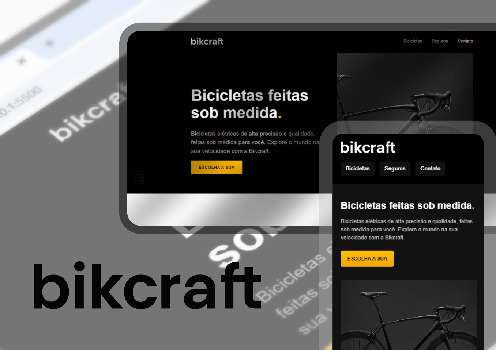

## Visão Geral

**Bikcraft** é um projeto de site responsivo para uma marca fictícia de **bicicletas elétricas personalizadas**, desenvolvido como prática do curso de **HTML e CSS para Iniciantes**, da Origamid. A plataforma oferece:

- Catálogo de modelos (Magic Might, Nimbus Stark, Nebula Cosmic) com personalização de cores e componentes;
- Seção de seguros (_prata_ e _ouro_) com detalhes de planos;
- Área de parceiros e depoimentos de clientes;
- Formulário de contato;
- Acessibilidade aos Termos e Condições.

O site foi totalmente codificado com **HTML e CSS puro**, seguindo instruções e boas práticas do curso.

---

## Dedicatória

> Este projeto foi realizado com base no curso **HTML e CSS para Iniciantes**, da Origamid — uma excelente introdução às fundações do desenvolvimento web. Agradeço aos instrutores pela clareza e motivação. O conteúdo apresentado foi fundamental para estruturar cada página e torná-las responsivas, funcionais e com boa usabilidade.

---

## Funcionalidades Responsivas

- **Design fluido**, adaptável a diferentes tamanhos de tela, desde desktops até dispositivos móveis.
- Uso de **media queries** no CSS para ajustar tamanhos de fonte, espaçamentos, distribuição de conteúdo e navegação.
- **Menu de navegação simples**, que se posiciona de forma flexível (horizontal ou vertical) conforme a largura da tela.
- **Imagens e elementos flexíveis**, que se redimensionam proporcionalmente sem distorção ou estouro de container.
- **Layouts em colunas e grid leve**, que reorganizam seções como “Bicicletas”, “Seguros”, “Parceiros” e “Contato” conforme o espaço disponível.

---

## Estrutura das Páginas e Layout

### 1. `index.html` (Home / Bicicletas)

- **Cabeçalho com menu**: alinhado horizontalmente no topo. Em telas menores, o layout se ajusta com padding reduzido e flex-wrap.

##### Mobile

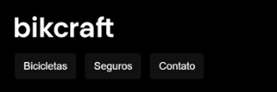

##### Desktop


---

- **Seção “Bicicletas feitas sob medida”**: títulos centralizados, listagem dos modelos em grid (cada card com título, preço e imagem), com **flexbox** ou **grid**.

##### Mobile

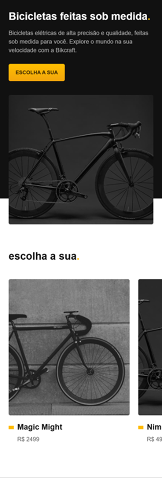

##### Desktop

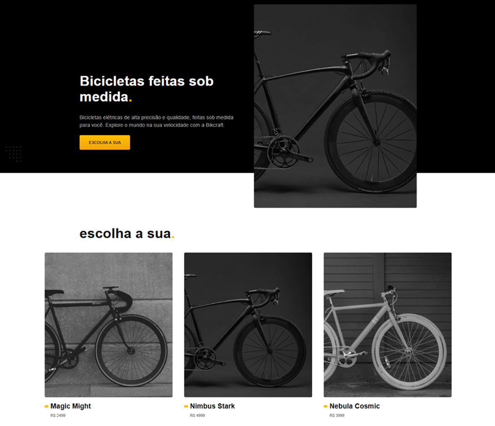

---

- **Depoimento com imagem**: texto e imagem alinhados com **flexbox**, centralizados.

##### Mobile

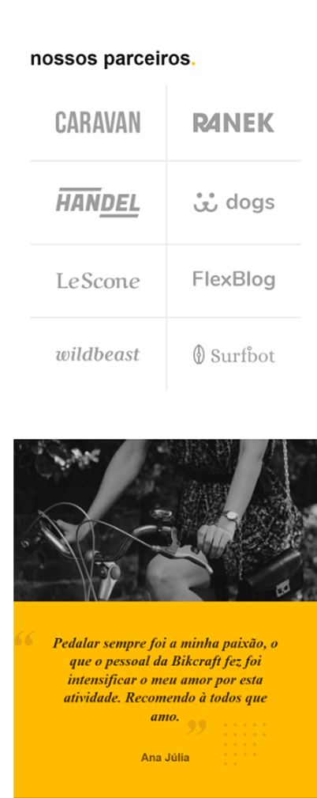

##### Desktop


---

- **Rodapé**: navegação e créditos, alinhados centralmente ou em colunas dependendo da largura.

##### Mobile

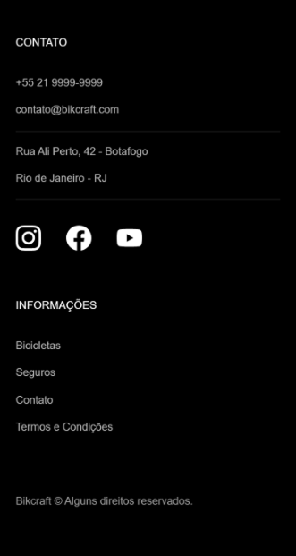

##### Desktop

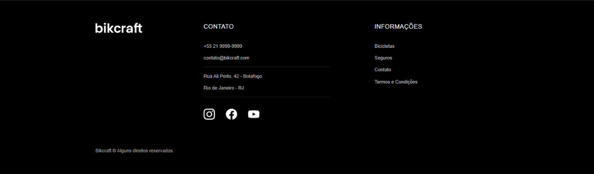

---

### 2. `seguros.html`

- **Cabeçalho igual ao da Home**.
- **Seções Prata e Ouro**: cards lado a lado em telas grandes (flexbox), empilhados verticalmente em telas pequenas, com descrições e botão “Inscreva-se”.
- **Alinhamento central** das informações com uso de margens automáticas (`margin: 0 auto;`).

##### Mobile

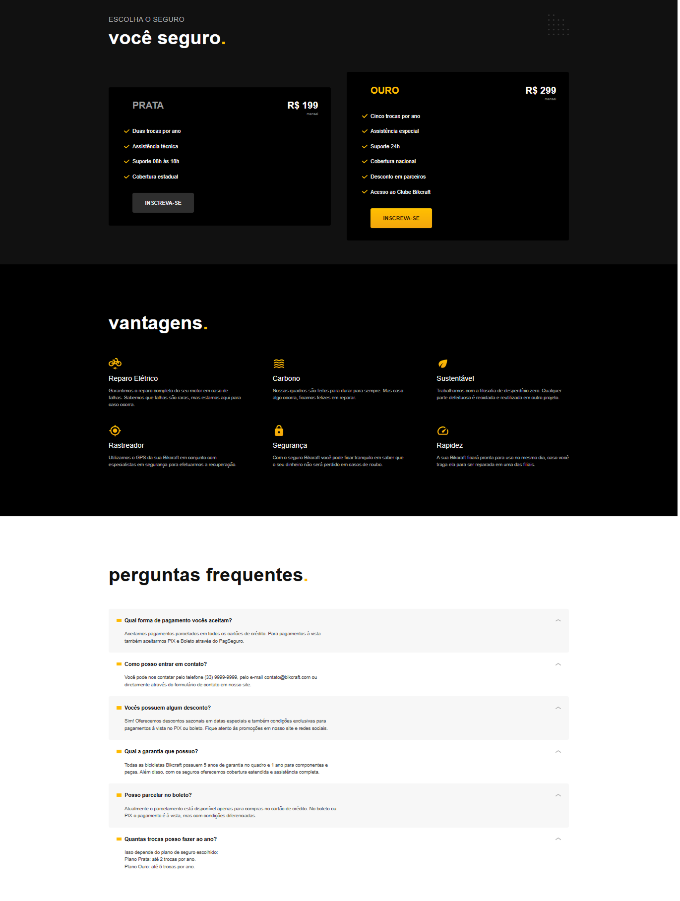

##### Desktop

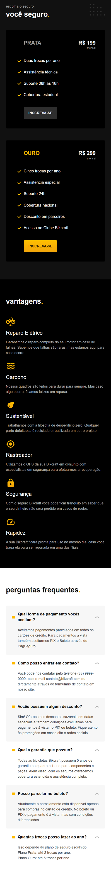

---

### 4. `contato.html`

- **Formulário de contato** centralizado dentro de um container com largura máxima.
- **Campos empilhados**, com inputs que se expandem para preenchimento confortável.
- Botão de envio destacado com cor de contraste e largura responsiva.

##### Mobile


##### Desktop


---

### 5. `termos.html`

- Layout de texto fluido (parágrafos justificados ou alinhados à esquerda).
- Cabeçalho e rodapé consistentes com o resto do site.

##### Mobile

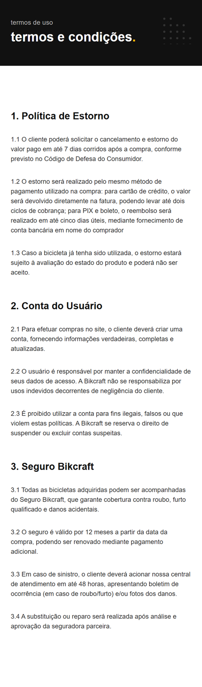

##### Desktop

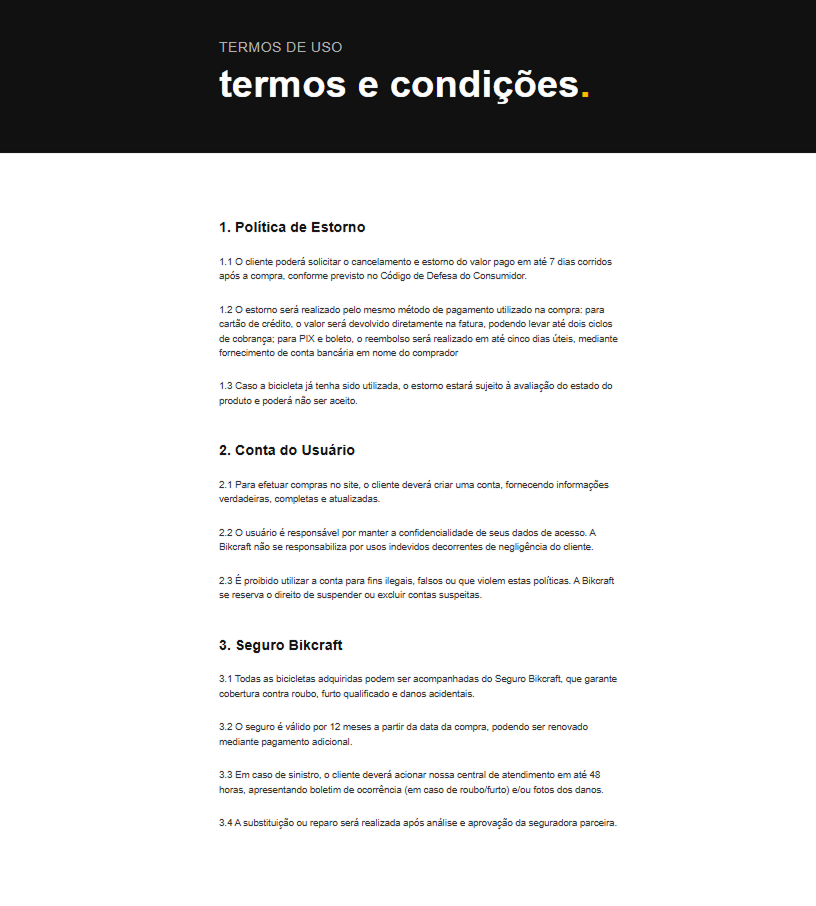

---

## Estrutura de Pastas

```
bikcraftFull/
├── css/
│   └── styles.css        ← Estilização de todas as páginas
├── img/                  ← Imagens usadas (modelos, logos, depoimentos etc.)
├── index.html
├── bicicletas.html
├── orcamento.html
├── seguros.html
├── contato.html
├── termos.html
└── LICENSE               ← Licença MIT
```

---

## Tecnologias Utilizadas

- **HTML5** nas páginas estruturais.
- **CSS3** com uso de:
  - Flexbox e Grid para organização de layout.
  - Media Queries para responsividade adaptativa.
  - Ajustes de tipografia e espaçamento para legibilidade.
- **Imagens otimizadas**, com dimensionamento proporcional e responsivo.

---

## Como Executar

1. Clone o repositório:
   ```bash
   git clone https://github.com/EmersonRomana/bikcraftFull.git
   ```
2. Abra `index.html` (ou outra página `.html`) no seu navegador.
3. Para testar responsividade, redimensione a janela ou use ferramentas de desenvolvedor (DevTools).

---

## Licença

Este projeto está licenciado sob a **MIT License** — consulte o arquivo `LICENSE` para mais detalhes.

---

## Agradecimentos

- Ao curso **HTML e CSS para Iniciantes**, da Origamid — pela base e inspiração.
- Aos autores e criadores de conteúdo open source que contribuíram para esse aprendizado.

---

### Notas Finais

Este **README.md** resume as páginas, layouts e responsividade implementados no projeto. Se quiser, posso detalhar estilos CSS específicos usados — como classes, media queries ou técnicas de alinhamento — só pedir! Também posso ajudar com templates visuais ou documentação adicional por página.
